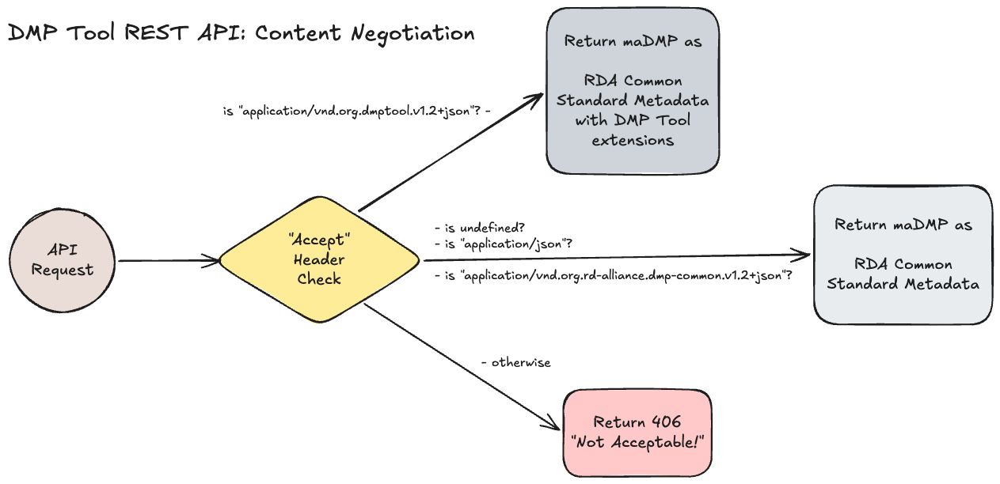

# dmptool-api - REST API interface for the DMP Tool. 

This is the REST API for the DMP Tool system. It follows the [RDA Common API Specification](https://github.com/RDA-DMP-Common/common-madmp-api) with support for the [RDA Common Standard for maDMPs v1.2](https://github.com/RDA-DMP-Common/RDA-DMP-Common-Standard/tree/master/examples/JSON/JSON-schema/1.2) and optionally, the [DMP Tool extensions](https://github.com/CDLUC3/dmptool-types/blob/main/schemas/dmptoolDmp.schema.json) to that standard.

**Current Version:** 3.0.0

See the [CHANGELOG.md](CHANGELOG.md) for details

To test out the API, please visit the [Swagger UI](http://dmptool-stg.uc3stg.cdlib.net/api/v3/documentation).

## Table of Contents
- [Authentication](#authentication)
- [Content Negotiation](#content-negotiation)
- [Endpoints](#endpoints)
  - [Query/List DMPs](#query--search-for-dmps)
  - [Get a DMP](#get-a-specific-dmp)
  - [Create a DMP](#create-a-dmp)
  - [Update/Replace a DMP](#replace-a-dmp)
  - [Delete a DMP](#delete-a-dmp)
  - [Validate maDMP JSON](#validate-madmp-json)
- [Errors](#errors)
- [DMP Examples](#dmp-format-examples)
- [DMP Tool Exceptions to the RDA Common Standard](#exceptions-to-the-rda-common-standard-format)
- [Installation](#installation)
  - [Prerequisites](#prerequisites)
  - [Development](#development)
  - [Versioning](#versioning)
    - [JSON Schema Changes](#json-schema-versions)
    - [API Changes](#api-versions)
- [Contributing](#contributing)
- [License](#license)

## Authentication

TODO: Add info about how to authenticate with the API.

## Authorization

TODO: Add info about what a particular user can see/do based on whether they are logged in and what theire role is.

## Content Negotiation

This API allows you to return maDMP metadata in either the RDA Common Standard format or the DMP Tool format. You can manage which format you receive through content negotiation.

If you want the DMP Tool format, you must specify it explicitly in the `Accept` header with the value `application/vnd.org.dmptool.v1.2+json`.

If you want the RDA Common Standard format, you can omit the `Accept` header entirely or specify either `application/json` or `application/vnd.org.rd-alliance.dmp-common.v1.2+json`.



See below for examples of what each format looks like.

## Endpoints

For the majority of endpoints, you can specify the format you would like to receive. See below for examples of each format. 
- For the RDA Common metadata standard use `Accept: application/vnd.org.rd-alliance.dmp-common.v1.2+json` this does not include the DMP Tool specific extensions.  
- To receive the full DMP with  DMP Tool extensions you should use: `Accept: application/vnd.org.dmptool.v1.2+json`.
- If you specify any other type, the API will return the RDA Common standard WITHOUT DMP Tool extensions by default.

### Query / Search for DMPs

**Note:** All DMP Ids that are included in the path of a request MUST be URL encoded. For example use `/dmps/10.10000%2FDMP123` instead of `/dmps/10.10000/DMP123`.

#### List/Search DMPs

The `GET /api/routes/dmps` endpoint lists all DMPs or allows for creating a filtered list of DMPs.

**Public access:**
When an authorization token is NOT provided, the API will only return DMPs who's privacy setting is "public".

**Authorized access:** 
When you provide a valid authorization token, you can set the `scope` argument to return either your own DMPs, your affiliation's DMPs or all DMPs (public, affiliation and your DMPs).

**Success Response:** 200

**Query string arguments:**
When filters are provided, all filters are applied using an "AND" relationship. For filters supporting lists, the individual values are applied using an "OR" relationship.
For items accepting more than one value you may pass multiple values by repeating the parameter in the query string for each item.

For example, if you specify `?created_after=2020-01-01T11:19:23Z&contact_ids=12345&contact_ids=09876` will be treated as "Created after '2020-01-01T11:19:23' AND has a contact with an id of '12345' OR '09876'".

- `scope` - type: `string`, enum: `['mine', 'affiliation', 'public']`, default: `public` 
- `created_before`: type: `string`, format: `date-time`, example: `2026-04-08T13:02:21Z`
- `created_after`: type: `string`, format: `date-time`, example: `2026-04-08T13:02:21Z`
- `modified_before`: type: `string`, format: `date-time`, example: `2026-04-08T13:02:21Z` 
- `modified_after`: type: `string`, format: `date-time`, example: `2026-04-08T13:02:21Z`
- `languages`: type: `array of strings`, format: 3 character language code ISO-639-3, default: `eng`
- `contact_ids`: type: `array of strings`, example: `['123', '0000-0000-0000-0000', 'user@example.com']`
- `contributor_ids`: type: `array of strings`, example: `['123', '0000-0000-0000-0000', 'user@example.com']`
- `dataset_ids`: type: `array of strings`, example: `['123', 'https://doi.org/00.00000/A1test', 'https://dataset.example.com/123']`
- `metadata_standard_ids`: type: `array of strings`, example: `['123', 'https://standard.example.com/123']`
- `dmp_ids`: type: `array of strings`, example: `['123', '00.0000/A1test']` 
- `funder_ids`: type: `array of strings`, example: `['123', 'https://ror.org/12345']`
- `grant_ids`: type: `array of strings`, example: `['123', 'https://grants.example.com/123']`
- `query`: type: `string`, example: `particle+physics`
- `ethical_issues_exist`: type: `boolean`
- `embargo_before`: type: `string`, format: `date`, example: `2026-04-08`
- `embargo_after`: type: `string`, format: `date`, example: `2026-04-08`
- `offset`: type: `integer`, default: `0`
- `count`: type: `integer`, default: `20`, max: `100`
- `sort`: type: `string`, enum: `['title,asc', 'title,desc', 'created,asc', 'created,desc', 'modified,asc', 'modified,desc', 'language,asc', 'language,desc', 'embargo,asc', 'embargo,desc', 'keyword,asc', 'keyword,desc']`, default: `created,desc`

The `scope` argument determines what type of DMPs will appear in the results. `public` returns only public DMPs `mine` returns only the DMPs that belong to you (the authorization token must be present), `affiliation` returns only the DMPs that belong to your affiliation (the authorization token must be provided and you must be an administrator).

Examples:
```bash
# Query for all public DMPs modified after January 1, 2026
curl -v "http://localhost:4060/api/routes/dmps?modified_after=2026-01-01T00:00:00"

# Query for all public DMPs modified after January 1, 2026 that are associated with a specific contributor and are about particle physics
curl -v "http://localhost:4060/api/routes/dmps?modified_after=2026-01-01T00:00:00&contriutor_ids=0000-0000-0000-0000&query=particle+physics"

# Query for you DMPs 
curl -v "http://localhost:4060/api/routes/dmps?scope=mine" -H "Authorization: Bearer <token>"
```

#### Get a specific DMP

The `GET /api/routes/dmps/:id` endpoint returns a DMP.

**Public access:**
When an authorization token is NOT provided, the API will only return DMPs who's privacy setting is "public". If you request a DMP that exists but that you do not have access to, you will receive a 404 Not Found error.

**Authorized access:**
When you provide a valid authorization token, you can request public DMPs, DMPs you own, or DMPs that are associated with your affiliation if you are an administrator.

You can also request historical versions of a DMP by including the `?version=2026-01-01T13:12:11Z` query string. The timestamp must match the value of a known historical version. To see a DMP's historical version list, call this endpoint (without the version) and review its `version` array property. 

**Success Response:** 200

Examples:
```bash
# Query for a public DMP and receive the RDA Common Standard format without DMP Tool extensions
curl -v "http://localhost:4060/api/routes/dmps/00.00000%2FA1123"
# OR
curl -v "http://localhost:4060/api/routes/dmps/00.00000%2FA1123" -H "Accept: application/vnd.org.rd-alliance.dmp-common.v1.2+json"

# Query for a public DMP and receive the RDA Common Standard format with DMP Tool extensions
curl -v "http://localhost:4060/api/routes/dmps/00.00000%2FA1123" -H "Accept: application/vnd.org.dmptool.v1.2+json"

# Query for a private DMP you own
# Query for you DMPs 
curl -v "http://localhost:4060/api/routes/dmps/00.00000%2FA1987" -H "Authorization: Bearer <token>"
```

#### Create a DMP

The `POST /api/routes/dmps` endpoint allows you to create a DMP.

You must provide a DMP as JSON metadata that conforms to the RDA Common Standard for maDMPs. The JSON metadata should include DMP Tool extensions if possible. 

**Note:** You MUST provide an authorization token for this endpoint

**Success Response:** 201

Example:
```bash
curl -v "http://localhost:4060/api/routes/dmps" \
     -X POST
     -H "Authorization: Bearer <token>" \
     -H "Content-Type: application/vnd.org.dmptool.v1.2+json" \
     -D '{ 
           "dmp": { 
             "title": "Test DMP",
             "dmp_id": { "identifier": "local-system-id", "type": "other" },
             "created": "2021-01-01 03:11:23Z",
             "modified": "2021-01-01 02:23:11Z",
             "ethical_issues_exist": "unknown",
             "language": "eng",
             "contact": {
               "name": "Test Contact",
               "mbox": "tester@example.com",
               "contact_id": [{ "identifier": "123456789", "type": "other" }]
             },
             "dataset": [{
               "title": "Test Dataset",
               "dataset_id": { "identifier": "123", "type": "other" },
               "personal_data": "unknown",
               "sensitive_data": "no"
             }]
           }
         }'
     
```

Some notes about the DMP format above:
- The minimal viable RDA Common Standard record with DMP Tool extensions is shown
- The API will ignore the values you send for `modified`. It will set this to the current time.
- The API will generate a new DMP id for the record. The one you provide in the `dmp_id` property will become an `alernate_identifier` (see: the https://github.com/RDA-DMP-Common/RDA-DMP-Common-Standard?tab=readme-ov-file#alternate_identifier_table) for the DMP. It's a good idea to set this to a URL or identifier from your own system. When you retrieve the DMP from this API, it will include this alternate identifier which you can then use to tie the record back to your system.
- The preferred `contact_id` is an ORCID, but you can also supply an email or an internal identifier that you can use to cross-reference with your own system.
- The `dataset_id` can either be a DOI or URL of a published output OR an internal identifier that you can use to cross-reference with your own system. 

#### Replace a DMP

The `PUT /api/routes/dmps/:id` endpoint allows you to replace the current DMP with the metadata you provide. If you just want to update a portion of a DMP record, you should call the `GET /api/routes/dmps/:id` endpoint first to retrieve the full DMP record. Then modify it as needed and send the update JSON record to this endpoint. 

You must provide a DMP as JSON metadata that conforms to the RDA Common Standard for maDMPs. The JSON metadata should include DMP Tool extensions if possible.

You also need to supply the `If-Unmodified-Since` header. The value of this header should match the `modified` timestamp on the original DMP record. If the timestamp in your header does not match the `modified` timestamp when you submit your update, you will receive a 409 Conflict error. this means that the copy of the DMP that you have has been modified since you retrieved it. You should then refetch the DMP and apply your changes to the more recent version.

**Note:** You MUST provide an authorization token for this endpoint

**Success Response:** 200

Example:
```bash
curl -v "http://localhost:4060/api/routes/dmps/00.00000%2FA1123" \
     -X PUT \
     -H "Authorization: Bearer <token>" \
     -H "If-Unmodified-Since: 2021-01-01 02:23:11Z" \
     -H "Content-Type: application/vnd.org.dmptool.v1.2+json" \
     -D '{ 
           "dmp": { 
             "title": "Updated title",
             "dmp_id": { "identifier": "local-system-id", "type": "other" },
             "created": "2021-01-01 03:11:23Z",
             "modified": "2021-01-01 02:23:11Z",
             "ethical_issues_exist": "no",
             "language": "eng",
             "contact": {
               "name": "Test Contact",
               "mbox": "tester@example.com",
               "contact_id": [{ "identifier": "123456789", "type": "other" }]
             },
             "dataset": [{
               "title": "Test Dataset",
               "dataset_id": { "identifier": "123", "type": "other" },
               "personal_data": "unknown",
               "sensitive_data": "no"
             }]
           }
         }'
```

#### Delete a DMP

The `DELETE /api/routes/dmps` endpoint allows you to replace the current DMP with the metadata you provide. If you just want to update a portion of a DMP record, you should call the `GET /api/routes/dmps/:id` endpoint first to retrieve the full DMP record. Then modify it as needed and send the update JSON record to this endpoint.

You must be either the owner/creator of the DMP or an administrator at the affiliation associated with the DMP in order to delete it. 

The DMP cannot be deleted if it has a `registered` timestamp. That timestamp indicates that the DMP id is a registered DOI and so we must retain it. In this scenario, the DMP will be tomb-stoned and its title will be prefixed with "OBSOLETE:". 

You also need to supply the `If-Unmodified-Since` header. The value of this header should match the `modified` timestamp on the original DMP record. If the timestamp in your header does not match the `modified` timestamp when you submit your update, you will receive a 409 Conflict error. this means that the copy of the DMP that you have has been modified since you retrieved it. You should then refetch the DMP and apply your changes to the more recent version.

**Note:** You MUST provide an authorization token for this endpoint

**Success Response:** 204

Example:
```bash
curl -v "http://localhost:4060/api/routes/dmps/00.00000%2FA1123" \
     -X DELETE
     -H "Authorization: Bearer <token>" \
     -H "If-Unmodified-Since: 2021-01-01 02:23:11Z"
```

#### Validate maDMP JSON

The `POST /api/routes/dmps/validate` endpoint allows you to check if a maDMP JSON is valid. This endpoint will report back any errors that are found in the JSON. 

**Success Response:** 200

Example:
```bash
curl -v "http://localhost:4060/api/routes/dmps/validate" \
     -X POST
     -H "Accept: application/vnd.org.rd-alliance.dmp-common.v1.2+json" \
     -H "Content-Type: application/vnd.org.rd-alliance.dmp-common.v1.2+json" \
     -D '{ 
           "dmp": { 
             "title": "Test title",
             "dmp_id": { "identifier": "local-system-id", "type": "other" },
             "created": "2021-01-01 03:11:23Z",
             "modified": "2021-01-01 02:23:11Z",
             "ethical_issues_exist": "no",
             "language": "eng",
             "contact": {
               "name": "Test Contact",
               "mbox": "tester@example.com",
               "contact_id": [{ "identifier": "123456789", "type": "other" }]
             },
             "dataset": [{
               "title": "Test Dataset",
               "dataset_id": { "identifier": "123", "type": "other" },
               "personal_data": "unknown",
               "sensitive_data": "no"
             }]
           }
         }'
```

## Errors

The API returns the following error codes:
- `400 bad_request` When a header, query string or path parameter are missing or invalid
- `400 dmp_invalid` When the DMP JSON sent in the body is invalid
- `401 unauthorized` When you are not authorized to perform the action
- `404 not_found` When the endpoint is not found
- `409 conflict` When the timestamp you provided in the header is out of date
- `429 too_many_requests` When you have reached a rate limit threshold
- `500 generic_error` When the API encounters an internal error

## DMP Format Examples

See the [sample JSON files](docs/jsonSamples) for examples of both the RDA Common Standard and DMP Tool JSON formats. 

The DMP Tool specific extensions are as follows:
- `rda_schema_version` the RDA standard that the record conforms to
- `provenance` the system that created the DMP
- `status` the current status of the DMP `["draft","complete","archived"]`
- `privacy` the privacy setting for the DMP `["public","private","embargoed"]`
- `featured` whether or not the DMP is featured on the "Public Plans page" of the DMP Tool UI
- `registered` the date the DMP id was registered as a DOI with DataCite
- `research_domain` the domain of the research project (e.g. "biology", "mathematics", etc.)
- `research_facility` information about any research facilities, labs, etc. where the research was performed or data was collected
- `funding_opportunity` the id of the funder's announcement or call for submissions. The `project_id` and `funder_id` here are used to tie the information to a specific funder in the main DMP record
- `funding_project` the funder's identifier for the research project. The `project_id` and `funder_id` here are used to tie the information to a specific funder in the main DMP record
- `version` the list of historical copies of the DMP and a URL to access them
- `narrative` the DMP narrative content including a URL to access a PDF version.

**Note:** The `narrative`, `status`, `research_facility` list, `funding_opportunity` and `funding_project` information are only accessible if the DMP's `privacy` is public OR you have access to the DMP!

## Exceptions to the RDA Common Standard format

The DMP Tool is structured differently than the RDA Common Standard with regard to DMPs and Projects. The RDA Common Standard allows for a single DMP to have multiple projects associated with it. The DMP Tool however, allows for multiple DMPs to be associated with a single project. Because of this the DMP metadata that the API works with will always have a 1-to-1 relationship between DMP and project.

The DMP Tool also differs from the RD Common Standard in the following ways:

We do NOT currently support the `cost` property:
```json
{
  "cost": [
    {
      "title": "Budget Cost",
      "description": "Description of budget costs",
      "value": 1234.56,
      "currency_code": "USD"
    }
  ]
}
```

We do NOT support the following properties on a `dataset`:
```json
{
  "data_quality_assurance": [
    "Statement about data quality assurance"
  ],
  "is_reused": false,
  "keyword": [
    "test",
    "physics"
  ],
  "language": "eng",
  "preservation_statement": "Statement about preservation",
  "security_and_privacy": [
    {
      "title": "Security and Privacy Statement",
      "description": "Description of security and privacy statement"
    }
  ],
  "alternate_identifier": [
    {
      "identifier": "https://example.com/dataset/123",
      "type": "url"
    }
  ],
  "technical_resource": [
    {
      "name": "Telescope",
      "description": "This is a description of the telescope",
      "technical_resource_id": [
        {
          "identifier": "https://example.com/telescope/123",
          "type": "url"
        }
      ]
    }
  ]
}
```

We do NOT support the following properties of `distribution`. The typical workflow for the DMP Tool is to have user's describe the research outputs they plan to produce as part of their project. Since the outputs have not bee created, there are now access URLs available:
```json
{
  "description": "This is a test distribution",
  "access_url": "https://example.com/dataset/123/distribution/123456789",
  "download_url": "https://example.com/dataset/123/distribution/123456789/download",
  "format": ["application/zip"]
}
```

We do NOT support the following properties of `host`. We attempt to make use of registries like [re3data](https://www.re3data.org/) when possible. Those registries maintain their own metadata and we prefer to use them as the source of truth:
```json
{
  "description": "This is a test host",
  "availability": "99.99",
  "backup_frequency": "weekly",
  "backup_type": "tapes",
  "certified_with": "coretrustseal",
  "geo_location": "US",
  "pid_system": ["doi", "ark"],
  "storage_type": "LTO-8 tape",
  "support_versioning": "yes"
}
```

## Installation

This API uses the [Fastify](https://fastify.dev) framework, a low-overhead web framework for Node.js.

### Prerequisites
- Node.js 22.x
- npm 11.x

### GraphQL Server and application UI
The following repositories are required. 
- The GraphQL server (Apollo Server), (see [dmptool-apollo-server](https://github.com/CDLUC3/dmptool-apollo-server)), performs the majority of the API's business logic and interacts with data sources. It establishes a Docker Compose network that is shared with the DMP Tool UI and this REST API.
- The UI, (see [dmptool-ui](https://github.com/CDLUC3/dmptool-ui)), is needed to generate an access token. An access token is needed to perform most write operations and to also scope what DMPs a user can access.

### Configuration
- Copy the `.env.example` file to `.env` and update the values as needed. Note that the `docker-compose.yml` file contains some of the same values.
- Follow the instructions in the [dmptool-apollo-server](https://github.com/CDLUC3/dmptool-apollo-server) repository to configure the Apollo server.
- Follow the instructions in the [dmptool-ui](https://github.com/CDLUC3/dmptool-ui) repository to configure the UI.

### Starting the REST API
- Start the Apollo server by running `docker compose up` in that `dmptool-apollo-server` directory. This also creates a MySQL database, DynamoDB table, and an Elasticache instance.
- Start the UI by running `docker compose up` in the `dmptool-ui` directory.
- Navigate to the UI at `http://localhost:3000` and login (see the UI repo's documentation for the sample usernames and passwords).
- Start this REST API by running `docker compose up`.
- Navigate to the Swagger UI at `http://localhost:4060/api/v3/documentation`.
- Navigate to the endpoint you want to test and click the `Try it out!` button.
- You can make use of the files in the `docs/jsonSamples` directory when testing out the POST and PUT requests.

### Testing
We strive to have 100% test coverage. We have unit tests for the individual functions and integration tests for the API endpoints. (COMING SOON: The integration tests run against a test instance of the API that is spun up using `docker compose` before the tests run and then is torn down after the tests are complete).

## Development

A Husky pre-commit hook is configured to run the linter and tests and security audits before each commit.

To start up the application for local development `docker compose up`. Note that the Apollo server and the UI are started in separate Docker containers.

To run the linter `npm run lint`.

To run tests `npm run test`.

To build the application `npm run build`.

To check for dependency vulnerabilities `npm audit` and `npm run trivy-all`.

To access the Swagger UI from the instance running locally visit: `http://localhost:4060/api/v3/documentation`.
**Note:** that the Swagger UI is currently not loading the routes properly

### Versioning

The system has two levels of versioning: 

#### JSON Schema Versions
The JSON schema versions are tied to the RDA Common Standard for maDMPs. We currently support [v1.2](https://github.com/RDA-DMP-Common/RDA-DMP-Common-Standard/tree/master/examples/JSON/JSON-schema/1.2). When the RDA Common Standard is updated, we need to update the `@dmptool/types` package to support those changes. Once those changes are made, the DMP Tool extensions schema should be updated so that it's version matches the RDA Common Standard. For example, if the RDA publishes v1.3 then the updated extension schema should be versioned as v1.3.

JSON schema versions are supported via content type negotiation. We currently support: 
- RDA Common Standard v1.2 `application/vnd.org.rd-alliance.dmp-common.v1.2+json` (DEFAULT) 
- RDA Common Standard with DMP Tool Extensions v1.2 `application/vnd.org.dmptool.v1.2+json`.

If new versions of these schemas are created and the structure of the API does not change, then we can simply add the new versions to the `src/serialization.ts` file's content negotiation logic to begin supporting the new versions. 

Other changes that would not break the API include:
- Adding a new endpoint
- Adding a new query parameter
- Dropping support for a specific version of the JSON schemas (assuming we have provided a long enough deprecation period)

When we do drop support for a specific version of the JSON schemas, we should add a `Sunset` header to the response to indicate when the schema will be removed from the API. We should, of course, also send out notifications to our contacts via email to let them know of the change.
An example of a `Sunset` header is:
```
Content-Type: application/vnd.org.rd-alliance.dmp-common.v1.2+json
Sunset: Sat, 31 Dec 2026 23:59:59 GMT 
```
Once the sunset date is reached, we should change the default content type and remove the old content type from the list of supported `accept` headers.

#### API Versions
We use a major-version-only scheme for versioning the API. We do this through the path (e.g. `/api/routes/dmps`).
The version number is only incremented when one of the following occurs:
- Change to the format of an existing endpoint
- Change to the format of the response body
- Change to the format of the request body
- Removing or changing an existing query parameter

## Contributing
Please read [CONTRIBUTING.md](CONTRIBUTING.md) for details on contributing.
Please read [CODE_OF_CONDUCT.md](CODE_OF_CONDUCT.md) for details on our code of conduct.

## License
This project is licensed under the MIT License - see the [LICENSE](LICENSE) for details.
